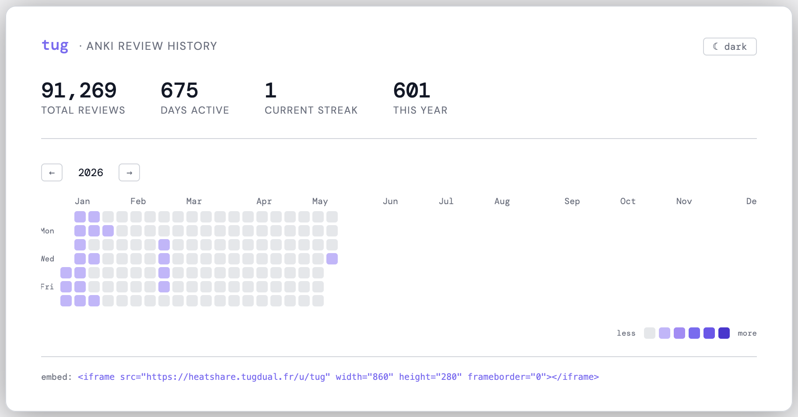

# HEATSHARE

Be accountable on your anki studies! Install the anki plugin, and share your heatmap with anyone. Fully open-source.

## Usage

Go to  and install the add-on ! You're good go 🔥

Your username will be your Anki profile name and registration happens automatically. View your heatmap by going Tools -> heatshare -> View my heatmap
Change your id by going Tools -> heatshare -> Update my username
